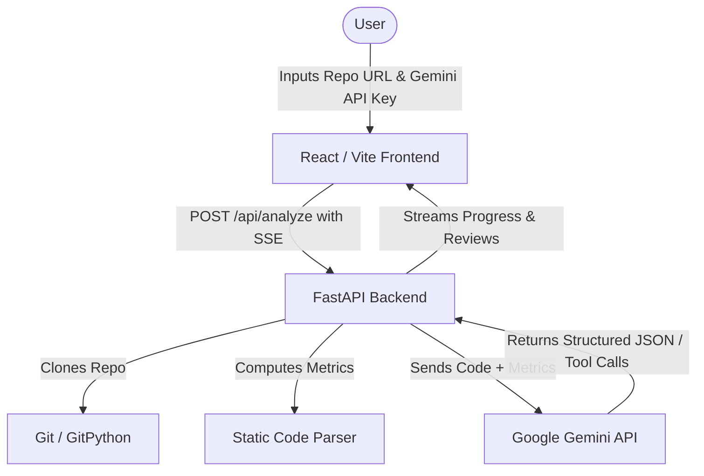

# 🌲 SourceSage

**SourceSage** is an AI-powered code review and documentation generator that analyzes GitHub repositories using Google Gemini models and streams analysis results to the client in real-time. It showcases modern Generative AI engineering patterns including structured JSON output, tool/function calling, and streaming Server-Sent Events (SSE).

---


## 🚀 Features

### 🔍 Real-Time AI Code Review
- Automatically clones any public GitHub repository.
- Filters and parses files by supported languages.
- Analyzes each file using Google Gemini for:
  - **Code quality and readability**
  - **Potential bugs and edge cases**
  - **Security vulnerabilities (OWASP Top-10)**
  - **Performance concerns**
  - **Best-practice adherence**
- Displays line-by-line annotations, severity categories (`critical`, `warning`, `info`), and detailed suggestions with code snippets.

### 📝 Automated Documentation
- Generates structured markdown documentation for each file in the repository.
- Includes module overviews, function/class breakdowns, parameters, return values, and usage examples.

### 📊 Repository Statistics
- Summarizes repository metrics including files scanned, average score, and issue counts.
- Interactive stats dashboard showing language breakdown and quality scores.

---

## 🛠️ Architecture

SourceSage is structured as a monorepo consisting of a FastAPI backend and a React (Vite) frontend:



- **Backend**: Python 3.10+, FastAPI, `google-genai` SDK, `sse-starlette` (for real-time streaming), `pydantic` (for type safety and validation), and `GitPython`.
- **Frontend**: React (Vite), CSS Variables (Dark/Light mode support), EventSource (for reading server-sent events).

---

## 🔧 Installation & Setup

### Prerequisites
- Python 3.10+
- Node.js 18+
- Git installed on your system
- A Google Gemini API Key (get one from Google AI Studio)

### 1. Backend Setup
Navigate to the `backend` directory, set up a virtual environment, and install dependencies:

```bash
# Go to backend folder
cd backend

# Create virtual environment
python -m venv venv

# Activate virtual environment
# On Windows:
venv\Scripts\activate
# On macOS/Linux:
source venv/bin/activate

# Install dependencies
pip install -r requirements.txt

# Create environment file (optional; Gemini key can also be provided directly via the UI)
copy .env.example .env
```

Start the FastAPI backend:
```bash
uvicorn app.main:app --reload
```
The API documentation will be available at `http://127.0.0.1:8000/docs`.

### 2. Frontend Setup
Navigate to the `frontend` directory and install dependencies:

```bash
# Go to frontend folder
cd ../frontend

# Install dependencies
npm install

# Run the dev server
npm run dev
```
Open `http://localhost:5173` in your browser.

---

## 🧪 GenAI Design Patterns Demonstrated
SourceSage implements three core patterns from Google's Generative AI playbook:
1. **Structured JSON Output**: Enforces schema validation using the Gemini API `response_mime_type="application/json"` and Pydantic schemas.
2. **Tool / Function Calling**: Empowers the LLM to call local helper tools dynamically to aid in code review tasks.
3. **SSE Streaming**: Streams partial outputs (cloning status, per-file analysis, final report compile) to provide a responsive and fast-feeling user experience.

---

## 📄 License
This project is open-source and available under the MIT License.
